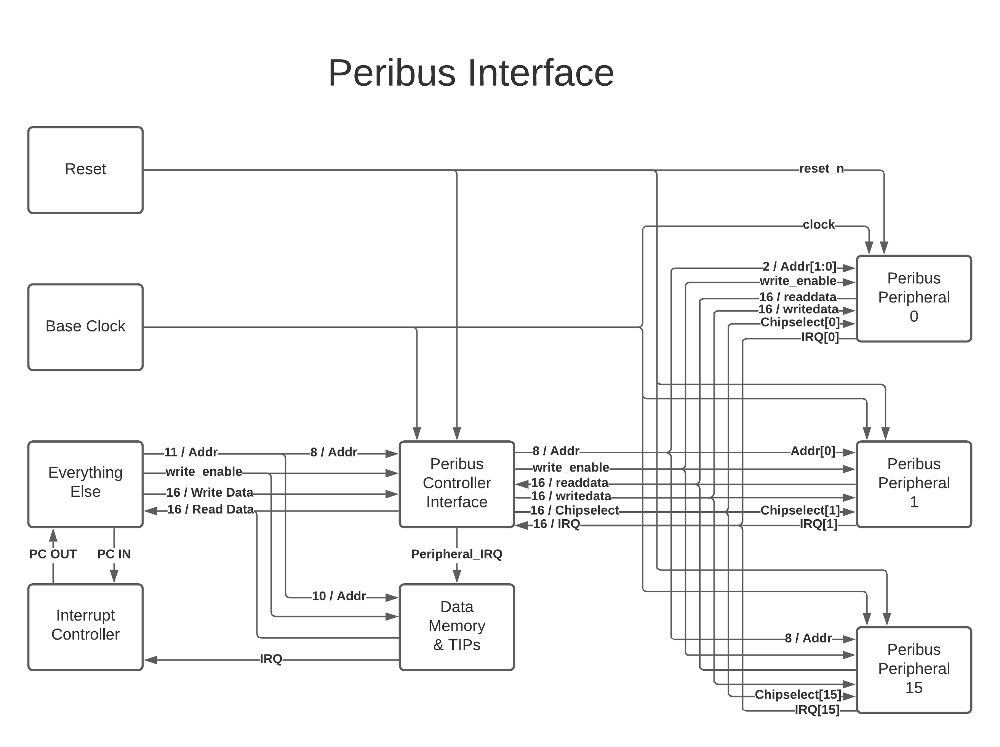

.. header::
        ===================        =====         ========        ==========================
        W\. Clayton Pannell        LUC16         12/01/20        pg. ###Page###/###Total###
        ===================        =====         ========        ==========================

===========
ISA Project
===========

Summary of Goals
================

* Minimal cpi low cost RISC ISA

  - signed 16 bit words. max 16 instructions.

* linear address 2^10 memory bytes, word addressable (2^9 words)

  - 4 for opcode 16 possible ops)

* Support the following C operations in assembly / machine code:

  - add, subtract, and, or

  - assignment

  - control flow (if-else, while, for, w/ operators ==, !=, >, <=, <, >=)

  - 2's complement signed 16bit int (int a;), 1D array of signed int (int a[11];)

* Implement Memory mapped peripheral bus

  - Implement GPIO Peripheral

  - Timer Peripheral

* Implement Interrupts and Interrupt Controller

Introduction
============

This document, and included files, make up a verilog implementation of the LUC16 microcontroller soft-core. The LUC16 is a custom, low resource cost, low instruction count, Instruction Set Architecture (ISA) that supports common high level (or at least C) language constructs. The instruction set centers around 16 bit signed data and uses 16 bit instructions. This ISA has been developed as a soft core on the terasIC DE2-115 Cyclone IVe development board. The architecture uses a single accumulator register and can perform all arithmetic instructions as an atomic read-modify-write cycle from/to memory and/or the register in a single instruction cycle. Because of this, the LUC16 is most similar to the Microchip PIC12 family of processors.

.. raw:: pdf

   PageBreak

Instructions
============

This Instruction Set Architecture uses only 16 Instructions. Each instruction completes execution in 1 full cycle. However, a full cycle requires 4 clock periods to complete. It is worth noting that the program counter output for instruction N occurs during the last quarter of instruction N-1's cycle.

.. image:: pics/Waves.png
   :width: 100%

Fig. 1. Verilog Simulation Output

.. raw:: pdf

   PageBreak

Instruction Word Decoding
-------------------------

This ISA uses a single instruction format. Each instruction consists of
a 5 bit opcode and an 11 bit literal value.

+--------+---------+
| Opcode | Literal |
+--------+---------+
| 15:11  | 10:0    |
+--------+---------+

The Opcode is further broken down into the Instruction Code and the
Destination bit.

+------------------+------------+
| Instruction code | Dest (W/M) |
+------------------+------------+
| 15:12            | 11         |
+------------------+------------+

Assembly instructions typically consist of the mnemonic, a literal
value, and the destination. The literal value is a numeric literal,
although preprocessor definitions are highly recommended for variable
names. The assembly code:

.. code:: asm

   w equ 0
   foo equ 0x001
   add foo,w

would result in

.. code:: asm

   add 0x001,0

after preprocessing which would be assembled into the machine code value 0x8001.

.. raw:: pdf

   PageBreak

Instruction Listing
-------------------

+-------+-----------+---------------+---------------+---------------+
| Instr | Mnem-onic | Description   | Affects       | Usage         |
|       |           |               | Status Regs   |               |
| code  |           |               |               |               |
+-------+-----------+---------------+---------------+---------------+
| 0     | mm        | move mem/reg  | Zero          | mm 0x21,w mm  |
|       |           | to w or self  |               | 0x22,m        |
|       |           | moving into   |               |               |
|       |           | self can be   |               |               |
|       |           | used to check |               |               |
|       |           | for Zero      |               |               |
|       |           | value of      |               |               |
|       |           | mem/reg       |               |               |
+-------+-----------+---------------+---------------+---------------+
| 1     | mwm       | move w into   |               | mwm 0x21      |
|       |           | mem/reg       |               |               |
+-------+-----------+---------------+---------------+---------------+
| 2     | mlw       | move 11bit    |               | mlw 0x01      |
|       |           | sign extended |               |               |
|       |           | literal into  |               |               |
|       |           | W register    |               |               |
+-------+-----------+---------------+---------------+---------------+
| 3     | rlm       | rotate        | Carry         | rlm 0x20,w    |
|       |           | mem/reg left  |               | rlm 0x21,m    |
|       |           | (through      |               |               |
|       |           | carry) store  |               |               |
|       |           | result in w   |               |               |
|       |           | or mem/reg    |               |               |
+-------+-----------+---------------+---------------+---------------+
| 4     | rrm       | rotate        | Carry         | rrm 0x20,w    |
|       |           | mem/reg right |               | rrm 0x21,m    |
|       |           | (through      |               |               |
|       |           | carry) store  |               |               |
|       |           | result in w   |               |               |
|       |           | or mem/reg    |               |               |
+-------+-----------+---------------+---------------+---------------+
| 5     | awm       | bitwise AND w | Zero          | awm 0x21,w    |
|       |           | with mem/reg  |               | awm 0x21,m    |
|       |           | store result  |               |               |
|       |           | in w or       |               |               |
|       |           | mem/reg       |               |               |
+-------+-----------+---------------+---------------+---------------+
| 6     | owm       | bitwise OR w  | Zero          | owm 0x21,1    |
|       |           | with mem/reg  |               | owm 0x21,m    |
|       |           | store result  |               |               |
|       |           | in w or       |               |               |
|       |           | mem/reg       |               |               |
+-------+-----------+---------------+---------------+---------------+
| 7     | xwm       | bitwise XOR w | Zero          | xwm 0x21,w    |
|       |           | with mem/reg  |               | xwm 0x21,m    |
|       |           | store result  |               |               |
|       |           | in w or       |               |               |
|       |           | mem/reg       |               |               |
+-------+-----------+---------------+---------------+---------------+
| 8     | add       | add w with    | Carry Zero    | add 0x20,w    |
|       |           | mem/reg store |               | add 0x21,m    |
|       |           | result in w   |               |               |
|       |           | or mem/reg    |               |               |
+-------+-----------+---------------+---------------+---------------+
| 9     | sub       | subtract w    | Carry Zero    | sub 0x20,w    |
|       |           | from mem/reg  |               | sub 0x21,m    |
|       |           | (mem/reg - w) |               |               |
|       |           | store result  |               |               |
|       |           | in w or       |               |               |
|       |           | mem/reg       |               |               |
+-------+-----------+---------------+---------------+---------------+
| A     | sms       | skip next     |               | sms 0x20      |
|       |           | instruction   |               |               |
|       |           | if value at   |               |               |
|       |           | mem/reg       |               |               |
|       |           | address is    |               |               |
|       |           | nonzero       |               |               |
+-------+-----------+---------------+---------------+---------------+
| B     | smc       | skip next     |               | smc 0x20      |
|       |           | instruction   |               |               |
|       |           | if value at   |               |               |
|       |           | mem/reg       |               |               |
|       |           | address is    |               |               |
|       |           | zero          |               |               |
+-------+-----------+---------------+---------------+---------------+
| C     | gol       | goto literal  |               | gol 0x005     |
|       |           | instruction   |               |               |
|       |           | mem address   |               |               |
+-------+-----------+---------------+---------------+---------------+
| D     | gow       | goto          |               | gow           |
|       |           | instruction   |               |               |
|       |           | mem address   |               |               |
|       |           | held in w     |               |               |
+-------+-----------+---------------+---------------+---------------+
| E     | wfi       | Halt Program  |               | wfi           |
|       |           | execution     |               |               |
|       |           | until next    |               |               |
|       |           | interrupt     |               |               |
+-------+-----------+---------------+---------------+---------------+
| F     | rfi       | return from   |               | rfi           |
|       |           | interrupt     |               |               |
|       |           | (restores PC  |               |               |
|       |           | to previous   |               |               |
|       |           | value + 2)    |               |               |
+-------+-----------+---------------+---------------+---------------+

.. raw:: pdf

   PageBreak

Instruction Details
-------------------

The table below shows how the assembly code is translated into machine
code. All values are displayed in binary format. The D symbol denotes
the Destination bit. The M symbol denotes that the literal value is a
data memory address. The P symbol denotes that the literal value is a
program memory address. The X symbol denotes that the literal value is a
sign extended number. The ? symbol denotes that the value is ignored.
The assembler will default to making these values 0. Note that the
meanings of different literal values are determined in the instruction
decode module. The use of the symbols here is only to better convey
understanding. see the instruction decode section for more details. For
"real-world" examples see the program.mem file included with this
document. This file contains C code that was hand compiled and hand
assembled to machine code.

+------------+------------------+-------------+---------------+----------------------+
| Asm Format | Instruction Code | Destination | Literal       | Machine Code         |
+------------+------------------+-------------+---------------+----------------------+
| mm M,D     | 0000             | D           | MMM_MMMM_MMMM | 0000_XMMM_MMMM_MMMM  |
+------------+------------------+-------------+---------------+----------------------+
| mwm M      | 0001             | ?           | MMM_MMMM_MMMM | 0001\_?MMM_MMMM_MMMM |
+------------+------------------+-------------+---------------+----------------------+
| mlw X      | 0010             | ?           | XXX_XXXX_XXXX | 0010\_?XXX_XXXX_XXXX |
+------------+------------------+-------------+---------------+----------------------+
| rlm M,D    | 0011             | D           | MMM_MMMM_MMMM | 0011_DMMM_MMMM_MMMM  |
+------------+------------------+-------------+---------------+----------------------+
| rrm M,D    | 0100             | D           | MMM_MMMM_MMMM | 0100_DMMM_MMMM_MMMM  |
+------------+------------------+-------------+---------------+----------------------+
| awm M,D    | 0101             | D           | MMM_MMMM_MMMM | 0101_DMMM_MMMM_MMMM  |
+------------+------------------+-------------+---------------+----------------------+
| owm M,D    | 0110             | D           | MMM_MMMM_MMMM | 0110_DMMM_MMMM_MMMM  |
+------------+------------------+-------------+---------------+----------------------+
| xwm M,D    | 0111             | D           | MMM_MMMM_MMMM | 0111_DMMM_MMMM_MMMM  |
+------------+------------------+-------------+---------------+----------------------+
| add M,D    | 1000             | D           | MMM_MMMM_MMMM | 1000_DMMM_MMMM_MMMM  |
+------------+------------------+-------------+---------------+----------------------+
| sub M,D    | 1001             | D           | MMM_MMMM_MMMM | 1001_DMMM_MMMM_MMMM  |
+------------+------------------+-------------+---------------+----------------------+
| sms M      | 1010             | ?           | MMM_MMMM_MMMM | 1010\_?MMM_MMMM_MMMM |
+------------+------------------+-------------+---------------+----------------------+
| smc M      | 1011             | ?           | MMM_MMMM_MMMM | 1011\_?MMM_MMMM_MMMM |
+------------+------------------+-------------+---------------+----------------------+
| gol P      | 1100             | ?           | PPP_PPPP_PPPP | 1100\_?PPP_PPPP_PPPP |
+------------+------------------+-------------+---------------+----------------------+
| gow        | 1101             | ?           | ???_????_???? | 1101\_????_????_???? |
+------------+------------------+-------------+---------------+----------------------+
| wfi        | 1110             | ?           | ???_????_???? | 1110\_????_????_???? |
+------------+------------------+-------------+---------------+----------------------+
| rfi        | 1111             | ?           | ???_????_???? | 1111\_????_????_???? |
+------------+------------------+-------------+---------------+----------------------+

.. raw:: pdf

   PageBreak

Instruction Justification
-------------------------

One of the goals of this project was to use only 16 instructions in the
ISA. This restriction required strong justifications for what
instructions made it into the ISA. The bare minimum instructions
required by this single register architecture to do anything are the
memory/register manipulation instructions: mm, mwm, and mlw. These
instructions handle moving data into and out of memory, as well as
setting up operands for all other instructions. The alternative to not
having a way to instantiate a literal value is too grim to consider.

The next easiest instructions to add were the arithmetic instructions:
add, sub, awm, owm. These basic instructions were explicitly required to
be present. The rotate/shift instructions, rlm and rrm, are needed in
order to implement power-of-two mutliplication and divison, which,
although not explicitly required, are nearly as ubuiquitous as the basic
arithmetic instructions. The xwm (XOR) was also not explicitly needed,
but is frequently needed in communications applications, negation, and
it rounded out the bitwise boolean operations nicely. A strong contender
for it's position was a complement instruction, but xwm could do the
same job and more.

The harder decisions to make were the control flow instructions. A
literal goto (gol) was needed to make jumps happen, and represents the
basis of a function call. A branch or computed goto would also be needed
to make function call returns possible. The computed goto (gow) was
chosen because it was much easier to use for function call purposes, and
doing lookup tables would only slightly more painful than with a branch
instruction. Once cost is brought into the equation, gow becomes a much
clearer winner since it fills the 4th slot in the 4 way Program Counter
Mux. Implementing a branch instruction would require adding another mux
between the skip mux and the Adder module.

The sms and smc "skip" instructions pair with the carry and zero ALU
status registers to build rudimentary comparison operations (less than,
greater than, equal, etc.). These operations are the building block of
comparison-based control flow operations (if, else, while, for, etc.).
Their inclusion is required, although their operation for this pupose is
admittedly painful, especially when dealing with mixed sign operands
(see the register section for more detail).

One of the requirements was to have a halt instruction. The wfi
instruction implements this, and could be further augmented into a low
power sleep mode by disabling any peripherals by piggy-backing off the
Int_Mux control line, if needed. Since the ISA now has the ability to
interrupt, it needs a way to return from the interrupt. This
functionality is provided by the rfi instruction which restores the
program counter from the PC Save register. It is worth pointing out that the
although a program can be halted indefinitely by using the goto literal
instruction pointing at its own address, the important distinction
between this and the wait for interrupt instruction is that the wfi instruction
will return to the following instruction upon exit from the interrupt whereas
using the gol instruction to halt will return to itself, effectively allowing
ONLY the interrupt to be executed.

If the 16 instruction restriction were lifted these are the operations
that would be nice to have, in order of importance: increment/decrement
memory (easier for loops), skip on less/greater than (easier signed
comparison), branch to Wreg value, branch to literal value,
add/subtract/and/or/xor Wreg with literal, load indirect memory access
value and increment/decrement pointer by literal. At this time, the simplicity
of having only one instruction type outweighs the benefits of adding more
instructions.

Architecture
============

Architecture Overview
---------------------
.. image:: pics/Architecture.png
   :width: 100%

Fig. 2. Architecture Block Diagram. Note that black wires are data, blue
wires are controls.

As previously mentioned the only 16 bit register used in the ISA is the
Working Register (W_REG) which is hardwired to the second operand
position in the ALU. There are also 2 1 bit registers that save the Zero
and Carry ALU outputs between operations (and can be read and written
through their respective memory mappings, see the Registers section
below for more detail). An 11 bit PC_Save register stores the program
counter value during interrupts to allow the program to return to normal
operation after exiting in the interrupt routine (rfi instruction).
Since a criteria for this project was minimal cost (defined by the
number of registers and busses used), the small registers can be summed
up as being just shy of a full 16 bit register (13 out of 16 bits used),
for a total of 2 16 bit registers.

The architecture uses one large 11 bit bus to pass the literal value to
the Data Memory module (address), W register (value, via the sign
extension block and Wreg input mux), and Program Counter (address, via
PC_Mux). This bus technically starts as the 16 bit instruction, but the
upper 5 bits immediately branch off into the Instruction Decoder. A
smaller 16 bit bus is used to pass the ALU result to the data memory and
the W register. Two very small 16 bit busses interconnect the ALU and
Wreg, with one 11 bit leg branching off the Wreg bus to drive the
Program Counter (via PC_Mux). For cost accounting it would be reasonable
to sum these as somewhere between 3 and 4 busses, given that the 11 bit
busses have to travel the furthest and interconnect several modules,
whereas the 16 bit busses only connect amongst the data memory, w
register (sometimes through a mux), and ALU. It is worth noting that
adding peripherals would need to connect to the data memory module via
at least 1 additional 16 bit bus.

Instruction Decoder
-------------------

The Instruction Decode module determines the control register outputs
based on the Opcode portion of the instruction. Both the Instruction
code and the Destination bit portions of the Opcode are used in this
determination. The table below enumerates the Instruction Decode
module's outputs. As mentioned in the Instruction Details section, some
operations ignore the destination bit of the opcode. Values marked with
'x' indicate that the input value is ignored, the default value produced
by the assembler is zero. For operations that do use the destination
bit, a value of 0 indicates that the result be stored in the W register
whereas a value of 1 indicates the result is to be stored in the data
memory.

+-------+-------+------+-------+-------+-------+-------+-------+-------+
| Instr | Mnem  | Dest | W_Mux | Mem\_ | P     | PC    | In    | A     |
| code  | -onic |      | [1:0] | Write | C_Mux | _Save | t_Mux | LU_Op |
|       |       |      |       |       | [1:0] |       |       | [3:0] |
+-------+-------+------+-------+-------+-------+-------+-------+-------+
| 0     | mm    | 0    | MEM   | 0     | ADD   | 0     | 0     | Zero  |
|       |       |      |       |       |       |       |       | Test  |
+-------+-------+------+-------+-------+-------+-------+-------+-------+
| 0     | mm    | 1    | WREG  | 1     | ADD   | 0     | 0     | Zero  |
|       |       |      |       |       |       |       |       | Test  |
+-------+-------+------+-------+-------+-------+-------+-------+-------+
| 1     | mwm   | x    | WREG  | 1     | ADD   | 0     | 0     | Nop   |
+-------+-------+------+-------+-------+-------+-------+-------+-------+
| 2     | mlw   | x    | LIT   | 0     | ADD   | 0     | 0     | Nop   |
+-------+-------+------+-------+-------+-------+-------+-------+-------+
| 3     | rlm   | 0    | ALU   | 0     | ADD   | 0     | 0     | RotL  |
+-------+-------+------+-------+-------+-------+-------+-------+-------+
| 3     | rlm   | 1    | WREG  | 1     | ADD   | 0     | 0     | RotL  |
+-------+-------+------+-------+-------+-------+-------+-------+-------+
| 4     | rrm   | 0    | ALU   | 0     | ADD   | 0     | 0     | RotR  |
+-------+-------+------+-------+-------+-------+-------+-------+-------+
| 4     | rrm   | 1    | WREG  | 1     | ADD   | 0     | 0     | RotR  |
+-------+-------+------+-------+-------+-------+-------+-------+-------+
| 5     | awm   | 0    | ALU   | 0     | ADD   | 0     | 0     | And   |
+-------+-------+------+-------+-------+-------+-------+-------+-------+
| 5     | awm   | 1    | WREG  | 1     | ADD   | 0     | 0     | And   |
+-------+-------+------+-------+-------+-------+-------+-------+-------+
| 6     | owm   | 0    | ALU   | 0     | ADD   | 0     | 0     | Or    |
+-------+-------+------+-------+-------+-------+-------+-------+-------+
| 6     | owm   | 1    | WREG  | 1     | ADD   | 0     | 0     | Or    |
+-------+-------+------+-------+-------+-------+-------+-------+-------+
| 7     | xwm   | 0    | ALU   | 0     | ADD   | 0     | 0     | Xor   |
+-------+-------+------+-------+-------+-------+-------+-------+-------+
| 7     | xwm   | 1    | WREG  | 1     | ADD   | 0     | 0     | Xor   |
+-------+-------+------+-------+-------+-------+-------+-------+-------+
| 8     | add   | 0    | ALU   | 0     | ADD   | 0     | 0     | Add   |
+-------+-------+------+-------+-------+-------+-------+-------+-------+
| 8     | add   | 1    | WREG  | 1     | ADD   | 0     | 0     | Add   |
+-------+-------+------+-------+-------+-------+-------+-------+-------+
| 9     | sub   | 0    | ALU   | 0     | ADD   | 0     | 0     | Sub   |
+-------+-------+------+-------+-------+-------+-------+-------+-------+
| 9     | sub   | 1    | WREG  | 1     | ADD   | 0     | 0     | Sub   |
+-------+-------+------+-------+-------+-------+-------+-------+-------+
| A     | sms   | x    | WREG  | 0     | ADD   | 0     | 0     | PC    |
|       |       |      |       |       |       |       |       | Zero  |
+-------+-------+------+-------+-------+-------+-------+-------+-------+
| B     | smc   | x    | WREG  | 0     | ADD   | 0     | 0     | PCZe  |
|       |       |      |       |       |       |       |       | robar |
+-------+-------+------+-------+-------+-------+-------+-------+-------+
| C     | gol   | x    | WREG  | 0     | LIT   | 0     | 0     | Nop   |
+-------+-------+------+-------+-------+-------+-------+-------+-------+
| D     | gow   | x    | WREG  | 0     | WREG  | 0     | 0     | Nop   |
+-------+-------+------+-------+-------+-------+-------+-------+-------+
| E     | wfi   | x    | WREG  | 0     | SAVE  | 1     | 0     | Nop   |
+-------+-------+------+-------+-------+-------+-------+-------+-------+
| F     | rfi   | x    | WREG  | 0     | SAVE  | 0     | 0     | Nop   |
+-------+-------+------+-------+-------+-------+-------+-------+-------+

For readability and understandability, variables were used for the ALU,
W_Mux, and PC_mux values. The enumeration for the ALU_Op values can be
found in the ALU section below. The Enumerations for W_Mux and PC_Mux
are as follows:

===== ===== ====== =====
W_Mux value PC_Mux value
ALU   0     ADD    0
MEM   1     WREG   1
LIT   2     LIT    2
WREG  3     SAVE   3
===== ===== ====== =====

The ALU
-------

ALU inputs:

1. operation control input (4 bits)
2. Carry status register (1 bit)
3. Zero status register (1 bit)
4. Memory output (signed 16 bit)
5. W Register output (signed 16 bit)

ALU outputs:

1. Program Counter control signal (Skip_Mux, 1 bit)
2. Carry Status Register (1 bit)
3. Zero status register (1 bit)
4. Operation result (signed 16 bit)

The carry and zero bits are status registers. These status bits can be used by both the ALU and by users (they are mapped in data memory as tightly integrated peripherals) to make decisions about the state of arithmatic. For example, if performing 32bit addition in software, the carry bit will be monitored by the program to determine when the lower byte has overflowed, necessitating an increment of the high bytes. The carry bit is also used as an inverted borrow bit for subtraction, allowing the program to determine that an operation underflowed in order to compare magnitude of the two values (<, >). Likewise, a set Zero bit after subtraction indicates equality of the subtracted values. See the Register Section for more information.

ALU Instructions
~~~~~~~~~~~~~~~~

Status bits pass through the ALU unaffected by the operation unless listed in the Affects Status box

+-------+-----------+--------------------------------------+---------+---------+------+
| Op    | Operation | Description                          | Used    | Affects | PC   |
| Code  |           |                                      | By      | Status  | Skip |
+-------+-----------+--------------------------------------+---------+---------+------+
| 0x0   | RotL      | Shift Mem 1 bit left, The bit in     | rlm     | Carry   | 0    |
|       |           | the carry position before the        |         |         |      |
|       |           | operation is shifted into the LSB.   |         |         |      |
|       |           | The MSB is shifted out, into the     |         |         |      |
|       |           | carry bit. W Unused.                 |         |         |      |
+-------+-----------+--------------------------------------+---------+---------+------+
| 0x1   | RotR      | Shift Mem 1 bit right, The bit in    | rrm     | Carry   | 0    |
|       |           | the carry position before the        |         |         |      |
|       |           | operation is shifted into the MSB.   |         |         |      |
|       |           | The LSB is shifted out, into the     |         |         |      |
|       |           | carry bit. W Unused.                 |         |         |      |
+-------+-----------+--------------------------------------+---------+---------+------+
| 0x2   | Add       | Adds W to Mem, Carry value is value  | add     | Carry   | 0    |
|       |           | of 17th bit of result (stripped to   |         | Zero    |      |
|       |           | 16 bit output), Zero set if result   |         |         |      |
|       |           | is 0.                                |         |         |      |
+-------+-----------+--------------------------------------+---------+---------+------+
| 0x3   | Sub       | Subtracts W from Mem (Mem - W),      | sub     | Carry   | 0    |
|       |           | Carry cleared if result is negative, |         | Zero    |      |
|       |           | Zero set if result is 0.             |         |         |      |
+-------+-----------+--------------------------------------+---------+---------+------+
| 0x4   | And       | Bitwise AND W and Mem, zero set if   | awm     | Zero    | 0    |
|       |           | result is 0                          |         |         |      |
+-------+-----------+--------------------------------------+---------+---------+------+
| 0x5   | Or        | Bitwise inclusive OR W and Mem, zero | owm     | Zero    | 0    |
|       |           | set if result is 0                   |         |         |      |
+-------+-----------+--------------------------------------+---------+---------+------+
| 0x6   | Xor       | Bitwise exclusive OR W and Mem, zero | xwm     | Zero    | 0    |
|       |           | set if result is 0                   |         |         |      |
+-------+-----------+--------------------------------------+---------+---------+------+
| 0x7   | ZeroTest  | Passes Mem to result, Zero set if    | mm      | Zero    |      |
|       |           | Mem  is 0                            |         |         |      |
+-------+-----------+--------------------------------------+---------+---------+------+
| 0x8   | PCZero    | Sets PC_Skip if Mem is nonzero,      | sms     |         | ?    |
|       |           | else clear                           |         |         |      |
+-------+-----------+--------------------------------------+---------+---------+------+
| 0x9   | PCZerobar | Sets PC_Skip if Mem is zero,         | smc     |         | ?    |
|       |           | else clear                           |         |         |      |
+-------+-----------+--------------------------------------+---------+---------+------+
| 0xA-F | Nop       | Passes W to result, No other         | mwm mlw |         | 0    |
|       |           | operation is performed               | gol gow |         |      |
|       |           |                                      | wfi rfi |         |      |
+-------+-----------+--------------------------------------+---------+---------+------+

Data Memory Unit
----------------

The data memory unit interfaces with the on-chip SRAM memory. This implementation is equipped with 512 16 bit words, totaling 1KByte of memory. The memory is word addressable only. For example memory addresses 0x000 and 0x001 contain two different 16bit words, as opposed to two bytes comprising a 16 bit word. There are no means of accessing or modifying only a single bit. All operations are performed on the entire 16-bit word

Indirect Memory Access
~~~~~~~~~~~~~~~~~~~~~~

The data memory unit includes the Indirect Memory Access peripheral which is implemented as a Tighly Integrated Peripherals. This peripheral allows programmatic access to data memory, as opposed to compile-time only literals. In other words, array offsets can be computed at run-time, for example:

.. code:: asm

   // array_var[i] = 32;
   mlw array_var        // load address of array_var
   mwf inda             // store address of array_var in in IMA pointer
   mm i,w               // load value of i
   add inda,m           // index i words into the array
   mlw .32              // load value of 32
   mwm indv             // store 32 at array_var[i]

This feature also eases the implementation of stack data structures as used by most C runtimes to store function call information. The following example is a function call from the demonstration program

.. code:: asm

    mm STACKPTR,w // get top of stack
    mwm MAIN_TEMP_0 // save original stack position
    mwm INDA  // point the Indirect access at the stack
    mlw MAIN_ADD_RETURN // return address
    mwm INDV
    mlw .1
    sub INDA,M // next stack address
    // load args right to left
    mm i,w
    mwm INDV
    mlw .1
    sub INDA,M // next stack address
    mlw j // &j
    mwm INDV
    mm INDA,w  // get new STACKPTR address
    mwm STACKPTR  // update STACKPTR
    gol ADD

Tightly Integrated Peripherals (TIPs)
-------------------------------------

Registers are memory mapped to 16 bit values and are word addressable (only) for user/program access through the data memory unit’s interface, starting from address 0x200. The first 5 words (addresses) are reserved for core registers and the Indirect Memory Access and Interrupt Enable core peripherals registers. The remainder of the 0x200-0x2FF address space is reserved for future TIP registers, if implemented.

**Note:** TIPs are part of the core architecture. While it is possible, user addition of additional peripherals here is discouraged. The implementation details of these peripherals are not intended to be stable and their interface with the rest of the data memory is not specified outsie of their implementation. User created FPGA peripherals are intended to interface with the PeriBus, which offers a more specified and stabilized interface.

Wreg
~~~~

-  Working Register (or W register)
-  16bit register
-  Memory mapped to 0x200
-  When accessed through the memory, this register is read-only
   (writes are ignored).
-  This register is used as a data input to ALU and is usually the
   second operand in arithmetic operations (see ALU and Instruction
   sections for more detail). Most operations can optionally store
   the result in the Wreg instead of in memory.

Carry
~~~~~

-  1bit register
-  Memory mapped to 0x201
-  When accessed through the memory, the least significant bit is mapped
   to the register.
   +  Upper 15 bits are read as 0
   +  Writes to the upper 15 bits are ignored
-  Used in and set by some ALU operations. For example:
   +  addition carry (set high on addition overflow, set low otherwise).
   +  subtraction borrow (inverted, set low on borrow)
   +  rotate input/output
-  Note : when subtracting unsigned or positive signed values, a clear
   Carry (borrow occurred) indicates that the value in W was greater
   than the value in Memory. If both signs are negative, then this logic
   is inverted. When dealing with mixed signs, the meaning of carry is
   determined by the position of the signed value. If working with
   signed numbers and no "compile-time" knowledge of the value's sign is
   available, then the program will have to determine the signed-ness of
   the operands. Fortunately, in the case of mixed signs, the sign bit
   will determine which operand is greater.

Zero
~~~~

-  1bit register
-  Memory mapped to 0x202
-  When accessed through the memory, the least significant bit is mapped
   to the register.
   +  Upper 15 bits are read as 0
   +  Writes to the upper 15 bits are ignored
-  Set by some ALU operations. For operations that affect the zero bit:
   +  set to 1 when the result is 0
   +  set to 0 when the result is nonzero

Indv
~~~~

-  Indirect Memory Access Peripheral, Value Register
-  16bit register
-  Memory mapped to 0x203
-  Accessible only through memory interface. Full read and write
   support.
-  Holds value of memory location pointed to by Inda

Inda
~~~~

-  Indirect Memory Access Peripheral, Address Register.
-  9 bit register
-  Memory mapped to 0x204
-  Accessible only through memory interface.
   +  Upper 7 bits are read as 0.
   +  Writes to upper 7 bits are ignored.
-  The value stored in Inda is the memory address pointer for Indv

IRQ
~~~

- Global Interrupt Control and Status Peripheral.
- Memory mapped to 0x205.
- Bit 0 is the Peripheral IRQ Flag.
  + This bit is set when a peripheral on the PeriBus has requested an interrupt.
- Bit 1 is the IRQ Enable.
  + When this bit is set, all PeriBus IRQs trigger an interrupt.

Peripheral Interface Bus (PeriBus)
----------------------------------

Fig. 3. PeriBus Interface Architecture

The PeriBus maps out-of-core peripherals into the address space, starting at 0x0300 and ending (by default) at 0x3FF. The PeriBus Controller's parameters can be adjusted to use the entire remaining address space if desired. From the programmer's perspective, PeriBus peripherals are interacted with just like any other memory region. From the implementor's perspective, the peribus provides 16bit read and write busses with 8 bits of register adressing, by default. The Peribus Controller multiplexes the chipselect and read bus to/from each peripheral, in addition to aggregating each peripheral's IRQ line. Read and Write timing is handled by the data memory unit, which provides apropriately timed read_enable and write_enable signals to the PeriBus. The read_enable line is a place holder and is currently "hard wired" on, as in the active PeriBus peripheral is read from on each clock. This may become functional in a future revision. The peripherals are provided a clock signal from the base clock (4x instruction clock) and have access to the same reset line as all other components in the system.

PeriBus Parameters
~~~~~~~~~~~~~~~~~~

The PeriBus Controller module offers 3 parameters than can be tuned to the implementor's liking. The defaults are reasonable, but can be adjusted for an exact fit in order to further reduce Logic Element usage.

-  MAX_PERIPHERALS: The maximum number of peripherals on the bus. Defaults to 8.
-  PERI_ADDR_WIDTH: The size, in 16-bit words, of the address space used by the PeriBus. Defaults to 0x100 words.
-  MAX_PERI_REGS: The maximum number of registers that can be used by any one peripheral. Defaults to 8.

General Purpose IO
~~~~~~~~~~~~~~~~~~

The GPIO port peripheral provide control of 16 bidirectional pins per port. Pins can be assigned to be either an input or an output. Inputs and Output pins can be present within the same port, and their direction can be set at runtime. Pin direction is controlled by setting the respective bit in the Pin Direction register to 1 for output or 0 for a high-impedence input. The state of each pin can be set or determined (output or input, respectively), by writing or reading the Pin State register. The GPIO peripheral provides an interrupt on change (IOC) functionality on each pin which can be individually enabled or disabled by setting or clearing (respectively) its respective bit in the IOC Enable register. On a change in pin state, if IOC is enable for that pin, the peripheral will set the pin's respective bit in the IRQ Flag register high. If any of the IRQ Flags in the port are asserted, the IRQ line for the peripheral will also be asserted. If interrupts are enabled, these flags must be cleared during the Interrupt Service Routine (ISR) or the IRQ line will immediately re-enter the ISR upon issuance of the return from interrupt (rfi) instruction.

The provided system includes two GPIO ports, GPIO_0 and GPIO_1 whose base addresses are 0x300 and 0x304, respectively. The interface is the same between both GPIO peripherals. On the DE2-115, GPIO_0 is connected to SW[15:0] and GPIO_1 is connected to LEDR[15:0].

+-----------------+-----------------------+
| Register Offset | Description           |
+-----------------+-----------------------+
| 0x0000          | Port State [15:0]     |
+-----------------+-----------------------+
| 0x0001          | Port Direction [15:0] |
+-----------------+-----------------------+
| 0x0002          | IOC Enable [15:0]     |
+-----------------+-----------------------+
| 0x0003          | IOC Flags [15:0]      |
+-----------------+-----------------------+

Interval Timer
~~~~~~~~~~~~~~

The provided system includes two 16-bit timer peripherals, TIMER_0 and TIMER_1, whose base addresses are 0x308 and 0x30C, respectively. The interface is the same between both timer peripherals. Like all other PeriBus peripherals on the DE2-115, this peripheral is driven by the 50MHz base clock. The timer peripherals are interval timers (counting down). A 1-256x prescale divider is provided and is controlled by manipulating the upper 8 bits in the control register. The prescale value is one higher than the control register prescale value (prescale = PRE + 1). The period is automatically loaded into the count when the run flag is set in the control register. Likewise, when the reload flag is set in the control register, the period is automatically reloaded into the count register when the count underflows. If the reload flag is not set the timer stops at counter underflow (although 0x0000 remains in the count register), and the Run flag is automatically cleared in the control register. Similarly, clearing the run flag stops the timer. Regardless of the state of the Automatic Reload or the IRQ Enable flags, when the counter underflows, the IRQ flag is set in the status register, until it is cleared by writing 0 into the status register. If the IRQ Enable flag is set, an IRQ is generated when the IRQ flag is set. This flag must be cleared within the interrupt service routine, or the interrupt will be immediately re-asserted upon calling the return from interrupt instruction.

**NOTE:** The timer can be polled outside the interrupt context by reading the status register to see if the IRQ flag is set. If it has been set, the timer has rolled over at least once.

+-----------------+---------------------------------------------------------------+
| Register Offset | Description                                                   |
+-----------------+---------------------------------------------------------------+
| 0x0000          | Timer Count[15:0]                                             |
+-----------------+---------------------------------------------------------------+
| 0x0001          | Timer Period [15:0]                                           |
+-----------------+---------------------------------------------------------------+
| 0x0002          | Control Register:                                             |
|                 | {Prescale [15:8], 0b00000, IRQ_ENABLE [2], RELOAD[1], RUN[0]} |
+-----------------+---------------------------------------------------------------+
| 0x0003          | Status Register: {0b0000_0000_0000_00, IRQ_FLAG[1], 0}        |
+-----------------+---------------------------------------------------------------+

Implementing PeriBus Peripherals
~~~~~~~~~~~~~~~~~~~~~~~~~~~~~~~~

The GPIO and Timer peripherals are provided as reference implementations of peripherals. These combined with the architectural diagram of the bus should provide a solid basis for implementing custom peripherals. When Implementing a new peripheral any FPGA resources (e.g. I/O Pins) need to be added to the module ports of the top level module (ISA), the Data Memory module (ram), the Peribus_Controller module, and the module of the custom peripheral. It is expected that future development will move the Peripheral_Controller module into the Top level, which will simplify the chain of modules that must be passed through. Next, Instantiate the custom peripheral module within the Peribus_Controller module, and add its address space to the multiplex block to allow connection of the custom peripheral's chipselect and read_data lines. Finally, connect the clock, reset_n, address, write_enable, read_enable, write_data, and IRQ lines between the custom peripheral and the controller.

Program Memory Unit
-------------------

The program memory is user accessible only during programming. The ISA
contains no method to modify program memory values, although a
peripheral could be implemented for that purpose. The verilog simulation
loads the program memory from the the program.mem file included with
this document. The program memory is word addressable and contains 512
16-bit words (1KByte). The program memory is addressed by the program
counter which can be controlled in various ways through the instruction
set.

Programming The LUC16
=====================

An example program is included in the root directory of the project. These program files represent the same program implemented in C (program.c), assembly(program.asm), and machine code (program.mem and program.mif). As of yet there is no C compiler or assembler support for this architecture. The C file was hand-compiled to assembly and, likewise, the assembly file was hand-assembled to machine code. A more generic include file is included (luc16.inc) as a convenience to provide register and vector definitions. The include file can be added to your program by using the INCLUDE directive of the (future) assembler. The text of the program.c, program.asm, and luc16.inc files have also been included as an appendix to this document.

Fixed Vectors
-------------

The ISA defines two fixed location vectors that must be respected by the linker (not currently implemented) or user-written fixed-location assembly files. Upon exiting from the reset state (SW[17] low on the DE2-115) the program counter is set to 0x0000. Upon entering the Interrupt state the program counter is set to 0x0004.

**Note:** If the application is extremely constrained on program memory and will not use interrupts it is permissible to place the startup code at 0x0000 and write over the interrupt vector. There is nothing special about these memory locations other than the conditions in which the hardware will jump to them. This is still discouraged as it not idiomatic, would make an interrupt into a partial reset if it is accidentally enabled, and only reclaims 4 words of program memory.

Calling Convention
------------------

There is no enforced calling convention.

For writing assembly, If the function is called from more than one place
it is recommended to use the W register to pass the return address (typ. PC + 1)
(callee saved if the W register is needed). However, it is just as
valid to implement a call stack and use W to pass the first parameter.
If memory use allows, further parameters can be passed using fixed
memory locations either shared amongst all functions or per-function. If
the function is only called from one place then gol can be used to
return and the W register can be used to pass the first argument and the
return value.

For C compilers, it is recommended to setup a stack as part of the
runtime starting from 0x1FF, moving up (numerically down). Use this
stack to pass the return address and function parameters. The caller
handles loading and cleaning the stack before and after calls. The order
of arguments will depend upon the compiler, but the calling convention
used in the samples provided is push the return address followed by the
arguments from right to left, and then the return value.

Conclusion
==========

This document and included files form a working low cost Instruction Set
Architecture. The design successfully “runs” the included program that
covers common C language constructs in a simulator. The simulated
hardware and program have been painstakingly checked for accuracy of
input and output at each sub-step of each instruction.

Appendix A: Tools used
======================

-  The verilog files were originally “compiled” using Icarus Verilog, a popular free open source software project. Development and compilation of the DE2-115 implementation was done in Intel Quartus Lite 20.1. This should be able to be compiled and loaded from the no-monetary-cost version of Quartus.
-  Waveforms were created from the simulation’s output VCD files using GTKWave. Modelsim was used for simulation and viewing waveforms for the DE2-115 implementation.
-  GNU Make was used to script the build operations. This allowed quickly switching between building the top-level verilog file and the unit-test testbench verilog files. The file named “Makefile” contains the build instructions used by Make. DE2-115 implementation files used Quartus' built-in build tools. If the project fails to load creating a new project, including all (System)Verilog files, and setting ISA.sv to the top-level file should be all that is required to build.
-  All Block Diagrams were built using Lucid Charts, a web-based flowcharting tool.

Appendix B: Example Program
===========================

An example program is included with the project deliverables. The c code
is contained in program.c, program.asm shows the c code hand compiled
into assembly, and program.mem contains the hand assembled machine code.
On the print version of this document the text of the .c and .asm files are
included below for completeness.

.. code-block:: c
   :include: program.c

.. code-block:: asm
   :include: program.asm

.. code-block:: asm
   :include: luc16.inc
