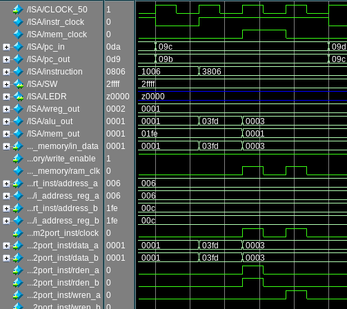
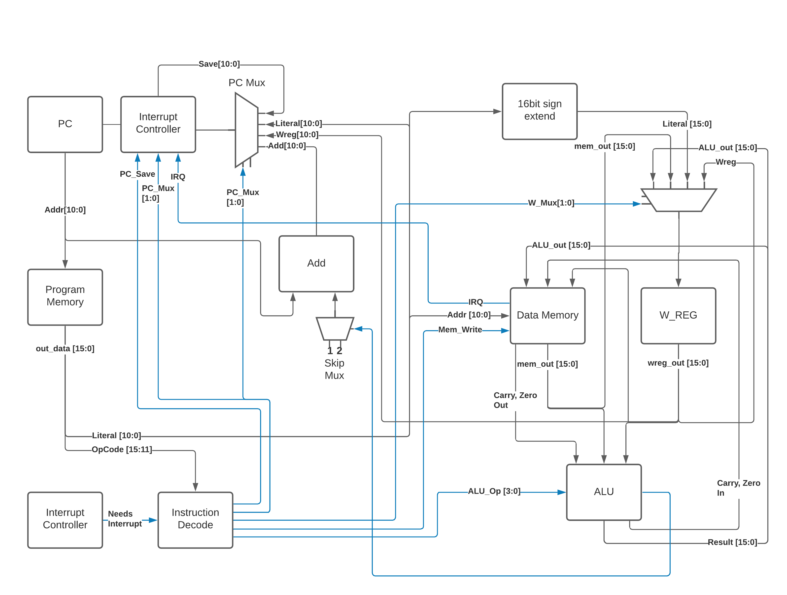

.. header::
        ===================        ===================         ========        ==========================
        W\. Clayton Pannell        CPE-531 ISA Project         12/01/20        pg. ###Page###/###Total###
        ===================        ===================         ========        ==========================

===========
ISA Project
===========

Summary of Goals
================

* Minimal cpi low cost RISC ISA

  - signed 16 bit words. max 16 instructions.

* linear address 2^10 memory bytes, word addressable (2^9 words)

  - 4 for opcode 16 possible ops)

* "Compile" C operations to assembly and machine code:

  - add, subtract, and, or

  - assignment

  - control flow (if-else, while, for, w/ operators ==, !=, >, <=, <, >=)

  - 2's complement signed 16bit int (int a;), 1D array of signed int (int a[11];)

Introduction
============

This document, and included files, make up a verilog implementation of a
low cost, low instruction count Instruction Set Architecture (ISA) that
supports common high level (or at least C) language constructs. The
instruction set centers around 16 bit signed data and uses 16 bit
instructions. No attempt has been made to run this ISA outside of a
simulator, much less on live hardware.

.. raw:: pdf

   PageBreak

Instructions
============

This Instruction Set Architecture uses only 16 Instructions. Each
instruction completes execution in 1 full cycle. It is worth noting that
the program counter output for instruction N occurs during the last
quarter of instruction N-1's cycle.

Fig. 1. Verilog Simulation Output

.. raw:: pdf

   PageBreak

Instruction Word Decoding
-------------------------

This ISA uses a single instruction format. Each instruction consists of
a 5 bit opcode and an 11 bit literal value.

+--------+---------+
| Opcode | Literal |
+--------+---------+
| 15:11  | 10:0    |
+--------+---------+

The Opcode is further broken down into the Instruction Code and the
Destination bit.

+------------------+------------+
| Instruction code | Dest (W/M) |
+------------------+------------+
| 15:12            | 11         |
+------------------+------------+

Assembly instructions typically consist of the mnemonic, a literal
value, and the destination. The literal value is a numeric literal,
although preprocessor definitions are highly recommended for variable
names. The assembly code:

.. code:: asm

   w equ 0
   foo equ 0x001
   add foo,w

would result in

.. code:: asm

   add 0x001,0

after preprocessing which would be assembled into the machine code value 0x8001.

.. raw:: pdf

   PageBreak

Instruction Listing
-------------------

+-------+-----------+---------------+---------------+---------------+
| Instr | Mnem-onic | Description   | Affects       | Usage         |
|       |           |               | Status Regs   |               |
| code  |           |               |               |               |
+-------+-----------+---------------+---------------+---------------+
| 0     | mm        | move mem/reg  | Zero          | mm 0x21,w mm  |
|       |           | to w or self  |               | 0x22,m        |
|       |           | moving into   |               |               |
|       |           | self can be   |               |               |
|       |           | used to check |               |               |
|       |           | for Zero      |               |               |
|       |           | value of      |               |               |
|       |           | mem/reg       |               |               |
+-------+-----------+---------------+---------------+---------------+
| 1     | mwm       | move w into   |               | mwm 0x21      |
|       |           | mem/reg       |               |               |
+-------+-----------+---------------+---------------+---------------+
| 2     | mlw       | move 11bit    |               | mlw 0x01      |
|       |           | sign extended |               |               |
|       |           | literal into  |               |               |
|       |           | W register    |               |               |
+-------+-----------+---------------+---------------+---------------+
| 3     | rlm       | rotate        | Carry         | rlm 0x20,w    |
|       |           | mem/reg left  |               | rlm 0x21,m    |
|       |           | (through      |               |               |
|       |           | carry) store  |               |               |
|       |           | result in w   |               |               |
|       |           | or mem/reg    |               |               |
+-------+-----------+---------------+---------------+---------------+
| 4     | rrm       | rotate        | Carry         | rrm 0x20,w    |
|       |           | mem/reg right |               | rrm 0x21,m    |
|       |           | (through      |               |               |
|       |           | carry) store  |               |               |
|       |           | result in w   |               |               |
|       |           | or mem/reg    |               |               |
+-------+-----------+---------------+---------------+---------------+
| 5     | awm       | bitwise AND w | Zero          | awm 0x21,w    |
|       |           | with mem/reg  |               | awm 0x21,m    |
|       |           | store result  |               |               |
|       |           | in w or       |               |               |
|       |           | mem/reg       |               |               |
+-------+-----------+---------------+---------------+---------------+
| 6     | owm       | bitwise OR w  | Zero          | owm 0x21,1    |
|       |           | with mem/reg  |               | owm 0x21,m    |
|       |           | store result  |               |               |
|       |           | in w or       |               |               |
|       |           | mem/reg       |               |               |
+-------+-----------+---------------+---------------+---------------+
| 7     | xwm       | bitwise XOR w | Zero          | xwm 0x21,w    |
|       |           | with mem/reg  |               | xwm 0x21,m    |
|       |           | store result  |               |               |
|       |           | in w or       |               |               |
|       |           | mem/reg       |               |               |
+-------+-----------+---------------+---------------+---------------+
| 8     | add       | add w with    | Carry Zero    | add 0x20,w    |
|       |           | mem/reg store |               | add 0x21,m    |
|       |           | result in w   |               |               |
|       |           | or mem/reg    |               |               |
+-------+-----------+---------------+---------------+---------------+
| 9     | sub       | subtract w    | Carry Zero    | sub 0x20,w    |
|       |           | from mem/reg  |               | sub 0x21,m    |
|       |           | (mem/reg - w) |               |               |
|       |           | store result  |               |               |
|       |           | in w or       |               |               |
|       |           | mem/reg       |               |               |
+-------+-----------+---------------+---------------+---------------+
| A     | sms       | skip next     |               | sms 0x20      |
|       |           | instruction   |               |               |
|       |           | if value at   |               |               |
|       |           | mem/reg       |               |               |
|       |           | address is    |               |               |
|       |           | nonzero       |               |               |
+-------+-----------+---------------+---------------+---------------+
| B     | smc       | skip next     |               | smc 0x20      |
|       |           | instruction   |               |               |
|       |           | if value at   |               |               |
|       |           | mem/reg       |               |               |
|       |           | address is    |               |               |
|       |           | zero          |               |               |
+-------+-----------+---------------+---------------+---------------+
| C     | gol       | goto literal  |               | gol 0x005     |
|       |           | instruction   |               |               |
|       |           | mem address   |               |               |
+-------+-----------+---------------+---------------+---------------+
| D     | gow       | goto          |               | gow           |
|       |           | instruction   |               |               |
|       |           | mem address   |               |               |
|       |           | held in w     |               |               |
+-------+-----------+---------------+---------------+---------------+
| E     | wfi       | Halt Program  |               | wfi           |
|       |           | execution     |               |               |
|       |           | until next    |               |               |
|       |           | interrupt     |               |               |
+-------+-----------+---------------+---------------+---------------+
| F     | rfi       | return from   |               | rfi           |
|       |           | interrupt     |               |               |
|       |           | (restores PC  |               |               |
|       |           | to previous   |               |               |
|       |           | value + 2)    |               |               |
+-------+-----------+---------------+---------------+---------------+

.. raw:: pdf

   PageBreak

Instruction Details
-------------------

The table below shows how the assembly code is translated into machine
code. All values are displayed in binary format. The D symbol denotes
the Destination bit. The M symbol denotes that the literal value is a
data memory address. The P symbol denotes that the literal value is a
program memory address. The X symbol denotes that the literal value is a
sign extended number. The ? symbol denotes that the value is ignored.
The assembler will default to making these values 0. Note that the
meanings of different literal values are determined in the instruction
decode module. The use of the symbols here is only to better convey
understanding. see the instruction decode section for more details. For
"real-world" examples see the program.mem file included with this
document. This file contains C code that was hand compiled and hand
assembled to machine code.

+------------+------------------+-------------+---------------+----------------------+
| Asm Format | Instruction Code | Destination | Literal       | Machine Code         |
+------------+------------------+-------------+---------------+----------------------+
| mm M,D     | 0000             | D           | MMM_MMMM_MMMM | 0000_XMMM_MMMM_MMMM  |
+------------+------------------+-------------+---------------+----------------------+
| mwm M      | 0001             | ?           | MMM_MMMM_MMMM | 0001\_?MMM_MMMM_MMMM |
+------------+------------------+-------------+---------------+----------------------+
| mlw X      | 0010             | ?           | XXX_XXXX_XXXX | 0010\_?XXX_XXXX_XXXX |
+------------+------------------+-------------+---------------+----------------------+
| rlm M,D    | 0011             | D           | MMM_MMMM_MMMM | 0011_DMMM_MMMM_MMMM  |
+------------+------------------+-------------+---------------+----------------------+
| rrm M,D    | 0100             | D           | MMM_MMMM_MMMM | 0100_DMMM_MMMM_MMMM  |
+------------+------------------+-------------+---------------+----------------------+
| awm M,D    | 0101             | D           | MMM_MMMM_MMMM | 0101_DMMM_MMMM_MMMM  |
+------------+------------------+-------------+---------------+----------------------+
| owm M,D    | 0110             | D           | MMM_MMMM_MMMM | 0110_DMMM_MMMM_MMMM  |
+------------+------------------+-------------+---------------+----------------------+
| xwm M,D    | 0111             | D           | MMM_MMMM_MMMM | 0111_DMMM_MMMM_MMMM  |
+------------+------------------+-------------+---------------+----------------------+
| add M,D    | 1000             | D           | MMM_MMMM_MMMM | 1000_DMMM_MMMM_MMMM  |
+------------+------------------+-------------+---------------+----------------------+
| sub M,D    | 1001             | D           | MMM_MMMM_MMMM | 1001_DMMM_MMMM_MMMM  |
+------------+------------------+-------------+---------------+----------------------+
| sms M      | 1010             | ?           | MMM_MMMM_MMMM | 1010\_?MMM_MMMM_MMMM |
+------------+------------------+-------------+---------------+----------------------+
| smc M      | 1011             | ?           | MMM_MMMM_MMMM | 1011\_?MMM_MMMM_MMMM |
+------------+------------------+-------------+---------------+----------------------+
| gol P      | 1100             | ?           | PPP_PPPP_PPPP | 1100\_?PPP_PPPP_PPPP |
+------------+------------------+-------------+---------------+----------------------+
| gow        | 1101             | ?           | ???_????_???? | 1101\_????_????_???? |
+------------+------------------+-------------+---------------+----------------------+
| wfi        | 1110             | ?           | ???_????_???? | 1110\_????_????_???? |
+------------+------------------+-------------+---------------+----------------------+
| rfi        | 1111             | ?           | ???_????_???? | 1111\_????_????_???? |
+------------+------------------+-------------+---------------+----------------------+

.. raw:: pdf

   PageBreak

Instruction Justification
-------------------------

One of the goals of this project was to use only 16 instructions in the
ISA. This restriction required strong justifications for what
instructions made it into the ISA. The bare minimum instructions
required by this single register architecture to do anything are the
memory/register manipulation instructions: mm, mwm, and mlw. These
instructions handle moving data into and out of memory, as well as
setting up operands for all other instructions. The alternative to not
having a way to instantiate a literal value is too grim to consider.

The next easiest instructions to add were the arithmetic instructions:
add, sub, awm, owm. These basic instructions were explicitly required to
be present. The rotate/shift instructions, rlm and rrm, are needed in
order to implement power-of-two mutliplication and divison, which,
although not explicitly required, are nearly as ubuiquitous as the basic
arithmetic instructions. The xwm (XOR) was also not explicitly needed,
but is frequently needed in communications applications, negation, and
it rounded out the bitwise boolean operations nicely. A strong contender
for it's position was a complement instruction, but xwm could do the
same job and more.

The harder decisions to make were the control flow instructions. A
literal goto (gol) was needed to make jumps happen, and represents the
basis of a function call. A branch or computed goto would also be needed
to make function call returns possible. The computed goto (gow) was
chosen because it was much easier to use for function call purposes, and
doing lookup tables would only slightly more painful than with a branch
instruction. Once cost is brought into the equation, gow becomes a much
clearer winner since it fills the 4th slot in the 4 way Program Counter
Mux. Implementing a branch instruction would require adding another mux
between the skip mux and the Adder module.

The sms and smc "skip" instructions pair with the carry and zero ALU
status registers to build rudimentary comparison operations (less than,
greater than, equal, etc.). These operations are the building block of
comparison-based control flow operations (if, else, while, for, etc.).
Their inclusion is required, although their operation for this pupose is
admittedly painful, especially when dealing with mixed sign operands
(see the register section for more detail).

One of the requirements was to have a halt instruction. The wfi
instruction implements this, and could be further augmented into a low
power sleep mode by disabling any peripherals by piggy-backing off the
Int_Mux control line, if needed. Since the ISA now has the ability to
interrupt, it needs a way to return from the interrupt. This
functionality is provided by the rfi instruction which restores the
program counter from the PC Save register.

If the 16 instruction restriction were lifted these are the operations
that would be nice to have, in order of importance: increment/decrement
memory (easier for loops), skip on less/greater than (easier signed
comparison), branch to Wreg value, branch to literal value,
add/subtract/and/or/xor Wreg with literal, load indirect memory access
value and increment/decrement pointer by literal.

Architecture
============

Architecture Overview
---------------------

Fig. 2. Architecture Block Diagram. Note that black wires are data, blue
wires are controls.

As previously mentioned the only 16 bit register used in the ISA is the
Working Register (W_REG) which is hardwired to the second operand
position in the ALU. There are also 2 1 bit registers that save the Zero
and Carry ALU outputs between operations (and can be read and written
through their respective memory mappings, see the Registers section
below for more detail). An 11 bit PC_Save register stores the program
counter value during interrupts to allow the program to return to normal
operation after exiting in the interrupt routine (rfi instruction).
Since a criteria for this project was minimal cost (defined by the
number of registers and busses used), the small registers can be summed
up as being just shy of a full 16 bit register (13 out of 16 bits used),
for a total of 2 16 bit registers.

The architecture uses one large 11 bit bus to pass the literal value to
the Data Memory module (address), W register (value, via the sign
extension block and Wreg input mux), and Program Counter (address, via
PC_Mux). This bus technically starts as the 16 bit instruction, but the
upper 5 bits immediately branch off into the Instruction Decoder. A
smaller 16 bit bus is used to pass the ALU result to the data memory and
the W register. Two very small 16 bit busses interconnect the ALU and
Wreg, with one 11 bit leg branching off the Wreg bus to drive the
Program Counter (via PC_Mux). For cost accounting it would be reasonable
to sum these as somewhere between 3 and 4 busses, given that the 11 bit
busses have to travel the furthest and interconnect several modules,
whereas the 16 bit busses only connect amongst the data memory, w
register (sometimes through a mux), and ALU. It is worth noting that
adding peripherals would need to connect to the data memory module via
at least 1 additional 16 bit bus.

Instruction Decoder
-------------------

The Instruction Decode module determines the control register outputs
based on the Opcode portion of the instruction. Both the Instruction
code and the Destination bit portions of the Opcode are used in this
determination. The table below enumerates the Instruction Decode
module's outputs. As mentioned in the Instruction Details section, some
operations ignore the destination bit of the opcode. Values marked with
'x' indicate that the input value is ignored, the default value produced
by the assembler is zero. For operations that do use the destination
bit, a value of 0 indicates that the result be stored in the W register
whereas a value of 1 indicates the result is to be stored in the data
memory.

+-------+-------+------+-------+-------+-------+-------+-------+-------+
| Instr | Mnem  | Dest | W_Mux | Mem\_ | P     | PC    | In    | A     |
| code  | -onic |      | [1:0] | Write | C_Mux | _Save | t_Mux | LU_Op |
|       |       |      |       |       | [1:0] |       |       | [3:0] |
+-------+-------+------+-------+-------+-------+-------+-------+-------+
| 0     | mm    | 0    | MEM   | 0     | ADD   | 0     | 0     | Zero  |
|       |       |      |       |       |       |       |       | Test  |
+-------+-------+------+-------+-------+-------+-------+-------+-------+
| 0     | mm    | 1    | WREG  | 1     | ADD   | 0     | 0     | Zero  |
|       |       |      |       |       |       |       |       | Test  |
+-------+-------+------+-------+-------+-------+-------+-------+-------+
| 1     | mwm   | x    | WREG  | 1     | ADD   | 0     | 0     | Nop   |
+-------+-------+------+-------+-------+-------+-------+-------+-------+
| 2     | mlw   | x    | LIT   | 0     | ADD   | 0     | 0     | Nop   |
+-------+-------+------+-------+-------+-------+-------+-------+-------+
| 3     | rlm   | 0    | ALU   | 0     | ADD   | 0     | 0     | RotL  |
+-------+-------+------+-------+-------+-------+-------+-------+-------+
| 3     | rlm   | 1    | WREG  | 1     | ADD   | 0     | 0     | RotL  |
+-------+-------+------+-------+-------+-------+-------+-------+-------+
| 4     | rrm   | 0    | ALU   | 0     | ADD   | 0     | 0     | RotR  |
+-------+-------+------+-------+-------+-------+-------+-------+-------+
| 4     | rrm   | 1    | WREG  | 1     | ADD   | 0     | 0     | RotR  |
+-------+-------+------+-------+-------+-------+-------+-------+-------+
| 5     | awm   | 0    | ALU   | 0     | ADD   | 0     | 0     | And   |
+-------+-------+------+-------+-------+-------+-------+-------+-------+
| 5     | awm   | 1    | WREG  | 1     | ADD   | 0     | 0     | And   |
+-------+-------+------+-------+-------+-------+-------+-------+-------+
| 6     | owm   | 0    | ALU   | 0     | ADD   | 0     | 0     | Or    |
+-------+-------+------+-------+-------+-------+-------+-------+-------+
| 6     | owm   | 1    | WREG  | 1     | ADD   | 0     | 0     | Or    |
+-------+-------+------+-------+-------+-------+-------+-------+-------+
| 7     | xwm   | 0    | ALU   | 0     | ADD   | 0     | 0     | Xor   |
+-------+-------+------+-------+-------+-------+-------+-------+-------+
| 7     | xwm   | 1    | WREG  | 1     | ADD   | 0     | 0     | Xor   |
+-------+-------+------+-------+-------+-------+-------+-------+-------+
| 8     | add   | 0    | ALU   | 0     | ADD   | 0     | 0     | Add   |
+-------+-------+------+-------+-------+-------+-------+-------+-------+
| 8     | add   | 1    | WREG  | 1     | ADD   | 0     | 0     | Add   |
+-------+-------+------+-------+-------+-------+-------+-------+-------+
| 9     | sub   | 0    | ALU   | 0     | ADD   | 0     | 0     | Sub   |
+-------+-------+------+-------+-------+-------+-------+-------+-------+
| 9     | sub   | 1    | WREG  | 1     | ADD   | 0     | 0     | Sub   |
+-------+-------+------+-------+-------+-------+-------+-------+-------+
| A     | sms   | x    | WREG  | 0     | ADD   | 0     | 0     | PC    |
|       |       |      |       |       |       |       |       | Zero  |
+-------+-------+------+-------+-------+-------+-------+-------+-------+
| B     | smc   | x    | WREG  | 0     | ADD   | 0     | 0     | PCZe  |
|       |       |      |       |       |       |       |       | robar |
+-------+-------+------+-------+-------+-------+-------+-------+-------+
| C     | gol   | x    | WREG  | 0     | LIT   | 0     | 0     | Nop   |
+-------+-------+------+-------+-------+-------+-------+-------+-------+
| D     | gow   | x    | WREG  | 0     | WREG  | 0     | 0     | Nop   |
+-------+-------+------+-------+-------+-------+-------+-------+-------+
| E     | wfi   | x    | WREG  | 0     | SAVE  | 1     | 0     | Nop   |
+-------+-------+------+-------+-------+-------+-------+-------+-------+
| F     | rfi   | x    | WREG  | 0     | SAVE  | 0     | 0     | Nop   |
+-------+-------+------+-------+-------+-------+-------+-------+-------+

For readability and understandability, variables were used for the ALU,
W_Mux, and PC_mux values. The enumeration for the ALU_Op values can be
found in the ALU section below. The Enumerations for W_Mux and PC_Mux
are as follows:

===== ===== ====== =====
W_Mux value PC_Mux value
ALU   0     ADD    0
MEM   1     WREG   1
LIT   2     LIT    2
WREG  3     SAVE   3
===== ===== ====== =====

The ALU
-------

ALU inputs:

1. operation control input (4 bits)
2. Carry status register (1 bit)
3. Zero status register (1 bit)
4. Memory output (signed 16 bit)
5. W Register output (signed 16 bit)

ALU outputs:

1. Program Counter control signal (Skip_Mux, 1 bit)
2. Carry Status Register (1 bit)
3. Zero status register (1 bit)
4. Operation result (signed 16 bit)

The carry and zero bits are status registers. These status bits can be
used by both the ALU and by users (they are mapped in data memory) to
make decisions about the state of arithmatic. For example, if performing
32bit addition in software, the carry bit will be monitored by the
program to determine when the lower byte has overflowed, necessitating
an increment of the high bytes. The carry bit is also used as an
inverted borrow bit for subtraction, allowing the program to determine
that an operation underflowed in order to compare magnitude of the two
values (<, >). Likewise, a set Zero bit after subtraction indicates
equality of the subtracted values. See the Register Section for more
information.

ALU Instructions
~~~~~~~~~~~~~~~~

Status bits pass through unless listed in the affects Status box

+-------+-----------+--------------------------------------+---------+---------+------+
| Op    | Operation | Description                          | Used    | Affects | PC   |
| Code  |           |                                      | By      | Status  | Skip |
+-------+-----------+--------------------------------------+---------+---------+------+
| 0x0   | RotL      | Shift Mem 1 bit left, The bit in     | rlm     | Carry   | 0    |
|       |           | the carry position before the        |         |         |      |
|       |           | operation is shifted into the LSB.   |         |         |      |
|       |           | The MSB is shifted out, into the     |         |         |      |
|       |           | carry bit. W Unused.                 |         |         |      |
+-------+-----------+--------------------------------------+---------+---------+------+
| 0x1   | RotR      | Shift Mem 1 bit right, The bit in    | rrm     | Carry   | 0    |
|       |           | the carry position before the        |         |         |      |
|       |           | operation is shifted into the MSB.   |         |         |      |
|       |           | The LSB is shifted out, into the     |         |         |      |
|       |           | carry bit. W Unused.                 |         |         |      |
+-------+-----------+--------------------------------------+---------+---------+------+
| 0x2   | Add       | Adds W to Mem, Carry value is value  | add     | Carry   | 0    |
|       |           | of 17th bit of result (stripped to   |         | Zero    |      |
|       |           | 16 bit output), Zero set if result   |         |         |      |
|       |           | is 0.                                |         |         |      |
+-------+-----------+--------------------------------------+---------+---------+------+
| 0x3   | Sub       | Subtracts W from Mem (Mem - W),      | sub     | Carry   | 0    |
|       |           | Carry cleared if result is negative, |         | Zero    |      |
|       |           | Zero set if result is 0.             |         |         |      |
+-------+-----------+--------------------------------------+---------+---------+------+
| 0x4   | And       | Bitwise AND W and Mem, zero set if   | awm     | Zero    | 0    |
|       |           | result is 0                          |         |         |      |
+-------+-----------+--------------------------------------+---------+---------+------+
| 0x5   | Or        | Bitwise inclusive OR W and Mem, zero | owm     | Zero    | 0    |
|       |           | set if result is 0                   |         |         |      |
+-------+-----------+--------------------------------------+---------+---------+------+
| 0x6   | Xor       | Bitwise exclusive OR W and Mem, zero | xwm     | Zero    | 0    |
|       |           | set if result is 0                   |         |         |      |
+-------+-----------+--------------------------------------+---------+---------+------+
| 0x7   | ZeroTest  | Passes Mem to result, Zero set if    | mm      | Zero    |      |
|       |           | Mem  is 0                            |         |         |      |
+-------+-----------+--------------------------------------+---------+---------+------+
| 0x8   | PCZero    | Sets PC_Skip if Mem is nonzero,      | sms     |         | ?    |
|       |           | else clear                           |         |         |      |
+-------+-----------+--------------------------------------+---------+---------+------+
| 0x9   | PCZerobar | Sets PC_Skip if Mem is zero,         | smc     |         | ?    |
|       |           | else clear                           |         |         |      |
+-------+-----------+--------------------------------------+---------+---------+------+
| 0xA-F | Nop       | Passes W to result, No other         | mwm mlw |         | 0    |
|       |           | operation is performed               | gol gow |         |      |
|       |           |                                      | wfi rfi |         |      |
+-------+-----------+--------------------------------------+---------+---------+------+

Data Memory Unit
----------------

The data memory unit interfaces with the on-chip SRAM memory. This
implementation is equipped with 512 16 bit words, totaling 1KByte of
memory. The memory is word addressable only. For example memory
addresses 0x000 and 0x001 contain two different 16bit words, as opposed
to two bytes comprising a 16 bit word.

Indirect Memory Access
~~~~~~~~~~~~~~~~~~~~~~

The data memory unit includes the Indirect Memory Access peripheral.
This peripheral allows programmatic access to data memory, as opposed to
compile-time only literals. In other words, array offsets can be
computed at run-time, for example:

.. code:: asm

   // array_var[i] = 32;
   mlw array_var        // load address of array_var
   mwf inda             // store address of array_var in in IMA pointer
   mm i,w               // load value of i
   add inda,m           // index i words into the array
   mlw .32              // load value of 32
   mwm indv             // store 32 at array_var[i]

Registers
---------

Registers are memory mapped to 16 bit values and are word addressable
(only) for user/program access through the data memory unit’s interface,
starting from address 0x200. The first 5 words (addresses) are reserved
for core registers and the Indirect Memory Access core peripheral
registers. The remainder of the address space would hold peripheral
control registers, if implemented.

Wreg
~~~~

-  Working Register (or W register)
-  16bit register
-  Memory mapped to 0x200
-  When accessed through the memory, this register is read-only
   (writes are ignored).
-  This register is used as a data input to ALU and is usually the
   second operand in arithmetic operations (see ALU and Instruction
   sections for more detail). Most operations can optionally store
   the result in the Wreg instead of in memory.

Carry
~~~~~

-  1bit register
-  Memory mapped to 0x201
-  When accessed through the memory, the least significant bit is mapped
   to the register.
   +  Upper 15 bits are read as 0
   +  Writes to the upper 15 bits are ignored
-  Used in and set by some ALU operations. For example:
   +  addition carry (set high on addition overflow, set low otherwise).
   +  subtraction borrow (inverted, set low on borrow)
   +  rotate input/output
-  Note : when subtracting unsigned or positive signed values, a clear
   Carry (borrow occurred) indicates that the value in W was greater
   than the value in Memory. If both signs are negative, then this logic
   is inverted. When dealing with mixed signs, the meaning of carry is
   determined by the position of the signed value. If working with
   signed numbers and no "compile-time" knowledge of the value's sign is
   available, then the program will have to determine the signed-ness of
   the operands. Fortunately, in the case of mixed signs, the sign bit
   will determine which operand is greater.

Zero
~~~~

-  1bit register
-  Memory mapped to 0x202
-  When accessed through the memory, the least significant bit is mapped
   to the register.
   +  Upper 15 bits are read as 0
   +  Writes to the upper 15 bits are ignored
-  Set by some ALU operations. For operations that affect the zero bit:
   +  set to 1 when the result is 0
   +  set to 0 when the result is nonzero

Indv
~~~~

-  Indirect Memory Access Peripheral, Value Register
-  16bit register
-  Memory mapped to 0x203
-  Accessible only through memory interface. Full read and write
   support.
-  Holds value of memory location pointed to by Inda

Inda
~~~~

-  Indirect Memory Access Peripheral, Address Register.
-  9 bit register
-  Memory mapped to 0x204
-  Accessible only through memory interface.
   +  Upper 7 bits are read as 0.
   +  Writes to upper 7 bits are ignored.
-  The value stored in Inda is the memory address pointer for Indv

Program Memory Unit
-------------------

The program memory is user accessible only during programming. The ISA
contains no method to modify program memory values, although a
peripheral could be implemented for that purpose. The verilog simulation
loads the program memory from the the program.mem file included with
this document. The program memory is word addressable and contains 512
16-bit words (1KByte). The program memory is addressed by the program
counter which can be controlled in various ways through the instruction
set.

Programming
===========

For an example program see the program.c, program.asm, and program.mem
files included with this document. The text of program.c and program.asm
have been included as an appendix to this document.

Calling Convention
------------------

There is no enforced calling convention.

For writing assembly, If the function is called from more than one place
it is recommended to use the W register to pass the return address (PC +
2) (callee saved if the W register is needed). However, it is just as
valid to implement a call stack and use W to pass the first parameter.
If memory use allows, further parameters can be passed using fixed
memory locations either shared amongst all functions or per-function. If
the function is only called from one place then gol can be used to
return and the W register can be used to pass the first argument and the
return value.

For C compilers, it is recommended to setup a stack as part of the
runtime starting from 0x1FF, moving up (numerically down). Use this
stack to pass the return address and function parameters. The caller
handles loading and cleaning the stack before and after calls. The order
of arguments will depend upon the compiler, but the calling convention
used in the samples provided is push the return address followed by the
arguments from right to left, and then the return value.

Conclusion
==========

This document and included files form a working low cost Instruction Set
Architecture. The design successfully “runs” the included program that
covers common C language constructs in a simulator. The simulated
hardware and program have been painstakingly checked for accuracy of
input and output at each sub-step of each instruction.

Special Thanks
==============

A special thanks to Dr. Gaede for lending me a stack of Verilog and
Digital Design books and pointing me in the right direction. This
project would not have been possible without this help.

Appendix A: Tools used
======================

-  The verilog files were “compiled” using Icarus Verilog, a popular
   free open source software project.
-  Waveforms were created from the simulation’s output VCD files using
   GTKWave
-  GNU Make was used to script the build operations. This allowed
   quickly switching between building the top-level verilog file and the
   unit-test testbench verilog files. The file named “Makefile” contains
   the build instructions used by Make.
-  The Architecture Block Diagram model was built using Lucid Charts, a
   web-based flowcharting tool.

Appendix B: Example Program
===========================

An example program is included with the project deliverables. The c code
is contained in program.c, program.asm shows the c code hand compiled
into assembly, and program.mem contains the hand assembled machine code.
On the print version of this document the text of the .c and .asm files are
included below for completeness.

.. code-block:: c
   :include: program.c

.. code-block:: asm
   :include: program.asm

